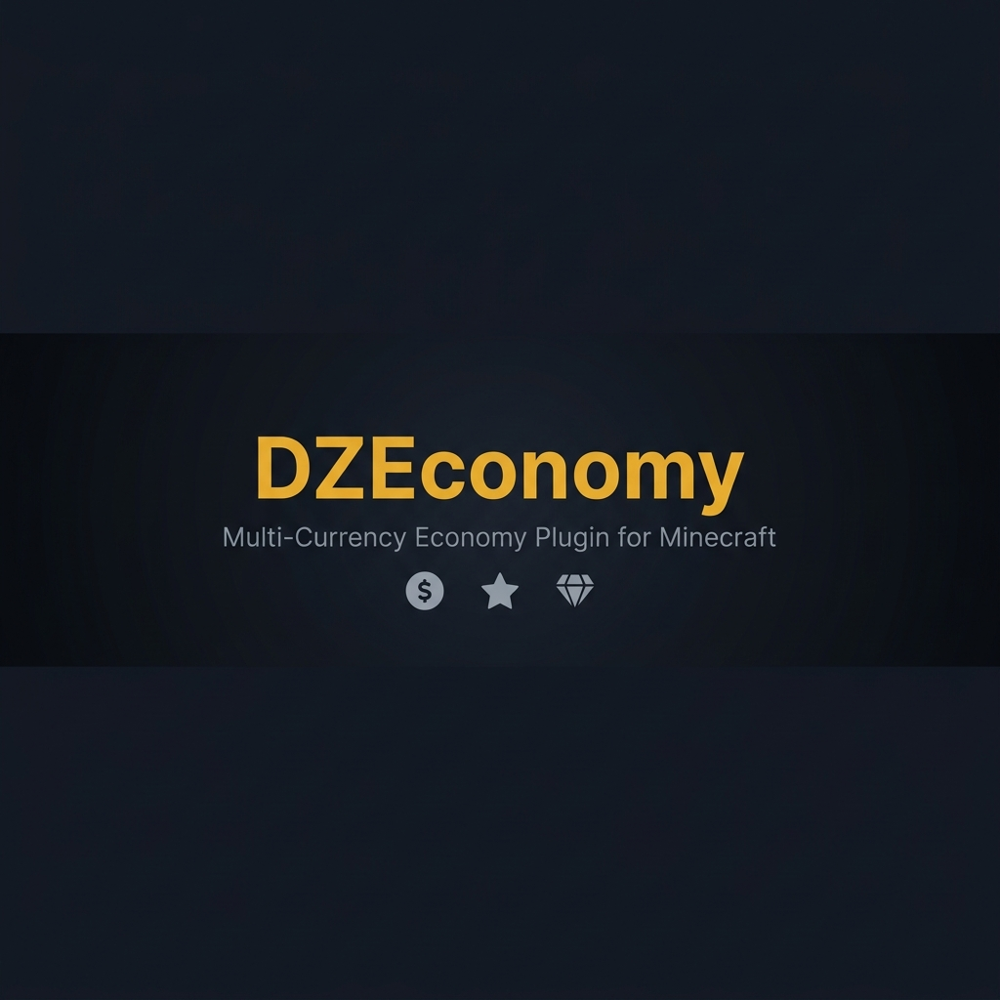
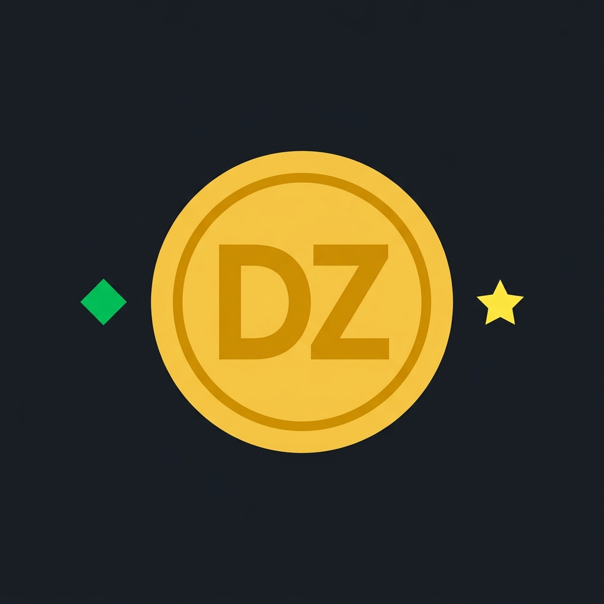
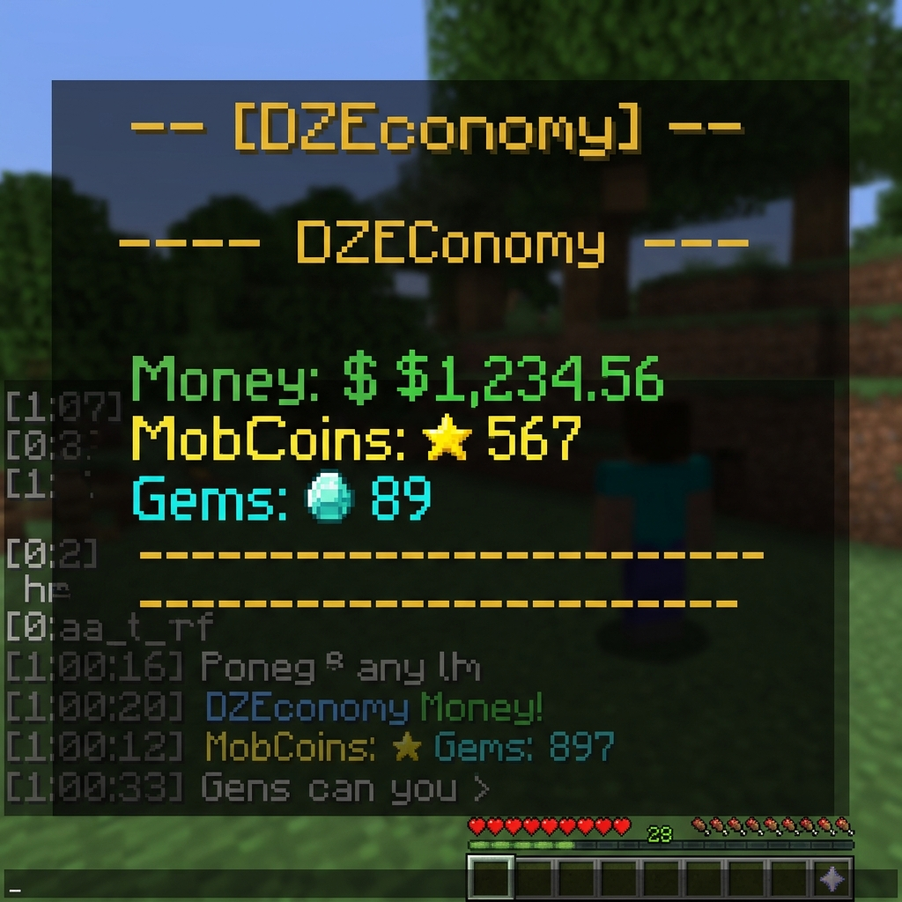
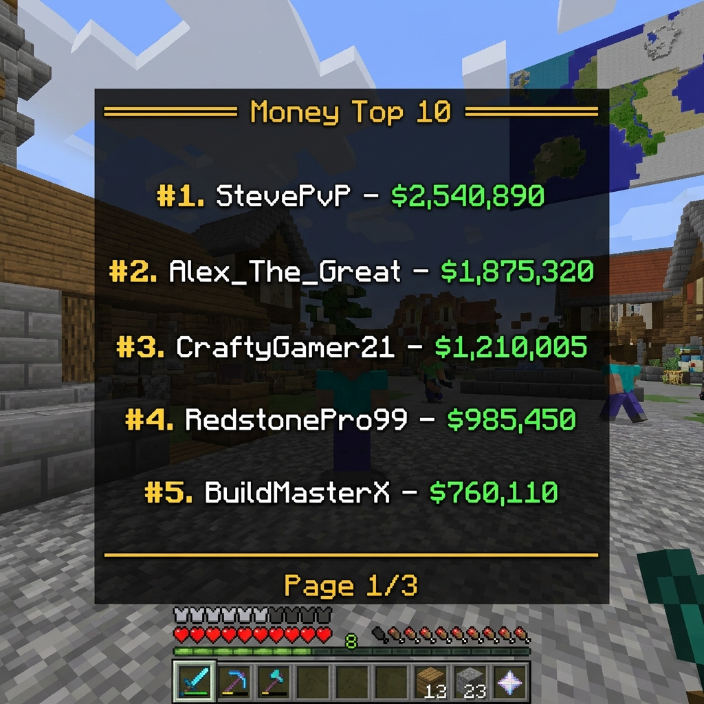
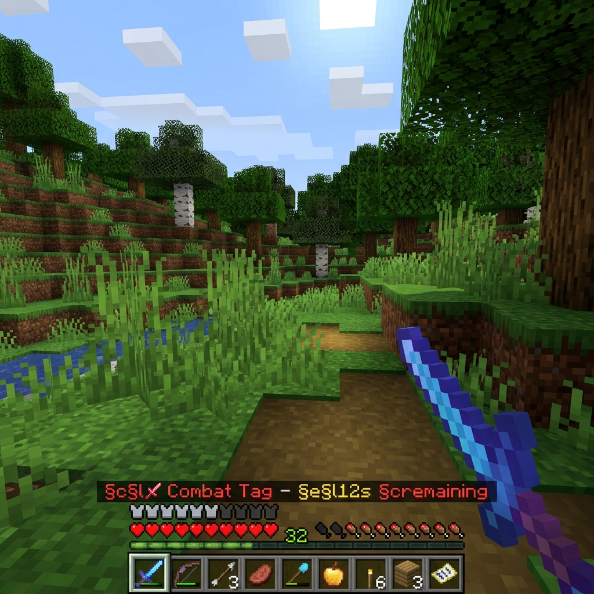
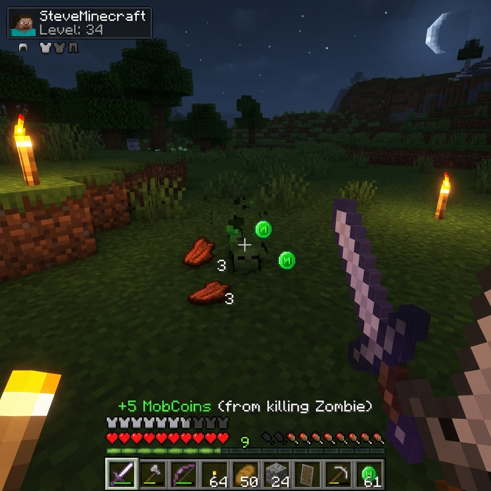
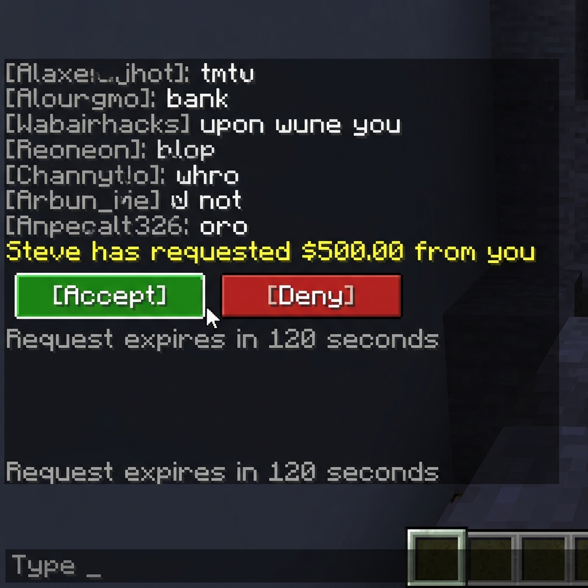
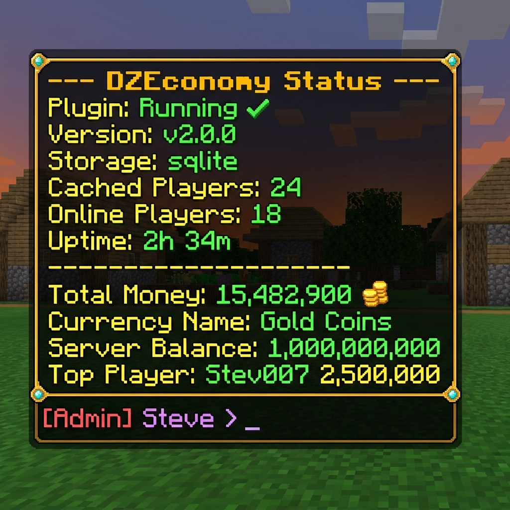

<div align="center">



<br>



# 🏦 DZEconomy

### The Ultimate Multi-Currency Economy Plugin for Minecraft

[](https://github.com/DemonZDevelopment/DZEconomy/releases)
[](https://www.gnu.org/licenses/gpl-3.0.en.html)
[](https://adoptium.net/)
[](https://papermc.io/)

[](https://modrinth.com/plugin/dzeconomy)
[](https://discord.gg/dzeconomy)
[](https://github.com/DemonZDevelopment/DZEconomy/wiki)

</div>

---

## 🌟 Overview

DZEconomy is a feature-rich, high-performance economy plugin built for **Paper 1.20+** servers. It provides three fully independent currency systems, LuckPerms rank integration, combat tagging, mob rewards, and a powerful developer API — all in one lightweight plugin.

---

## 📸 Screenshots

<p align="center">
  
  &nbsp;&nbsp;
  
</p>
<p align="center">
  
  &nbsp;&nbsp;
  
</p>
<p align="center">
  
  &nbsp;&nbsp;
  
</p>

---

## ✨ Features

| Category | Feature | Description |
|----------|---------|-------------|
| 💰 | **Triple Currency System** | Money, MobCoins, and Gems — each independent with custom formatting, limits, and settings |
| 🏅 | **LuckPerms Rank Integration** | Per-rank balance caps, tax rates, and reward multipliers |
| ⚔️ | **Combat Tag System** | Block economy actions during PvP to prevent abuse |
| 🐾 | **Mob Rewards** | Per-mob currency drops with spawner detection |
| 🔄 | **Currency Conversion** | Configurable conversion paths with rates, fees, and cooldowns |
| 💾 | **Multi-Backend Storage** | SQLite (default), MySQL, and FlatFile with built-in migration |
| 🔌 | **Developer API** | Full API with events, async support, and batch operations |
| 🚀 | **High Performance** | Async operations, intelligent caching, and batch writes |
| 🌍 | **Fully Configurable** | MiniMessage formatting, customizable messages, and modular config |
| 🔢 | **PlaceholderAPI** | Placeholders for all balances and rank info |
| 📝 | **Transaction Logging** | CSV/JSON audit logs with rotation |
| 🌿 | **Folia Compatible** | Full region-based scheduling support out of the box |

---

## 🚀 Quick Start

1. **Download** the latest release from [Modrinth](https://modrinth.com/plugin/dzeconomy) or [GitHub Releases](https://github.com/DemonZDevelopment/DZEconomy/releases)
2. **Place** `DZEconomy-2.0.0.jar` in your server's `plugins/` folder
3. **Restart** your server
4. **Configure** `config.yml` to your liking (defaults work great!)
5. **Done!** ✅ Players now have balances for all three currencies

### Requirements

| Requirement | Minimum | Recommended |
|---|---|---|
| Server Software | Paper 1.20 | Paper 1.21+ |
| Java | 21 | 21 (latest) |
| LuckPerms | Optional | ✅ Recommended |
| PlaceholderAPI | Optional | ✅ Recommended |

> ⚠️ **Note:** DZEconomy is designed for **Paper** servers but also supports Spigot, Folia, and Purpur. See the [Installation Wiki](https://github.com/DemonZDevelopment/DZEconomy/wiki/Installation) for details.

---

## 💻 Commands Overview

### Player Commands

| Command | Description |
|---------|-------------|
| `/money` | Check your money balance |
| `/money send <player> <amount>` | Send money to another player |
| `/money top` | View money leaderboard |
| `/mobcoin` | Check your MobCoin balance |
| `/mobcoin send <player> <amount>` | Send MobCoins to another player |
| `/mobcoin top` | View MobCoin leaderboard |
| `/gem` | Check your Gem balance |
| `/gem send <player> <amount>` | Send Gems to another player |
| `/gem top` | View Gem leaderboard |
| `/economy convert <player> <from> <to> <amount>` | Convert between currencies |

### Admin Commands

| Command | Description |
|---------|-------------|
| `/economy reload` | Reload all configuration files |
| `/economy status` | View plugin status and statistics |
| `/economy migrate <from> <to>` | Migrate between storage backends |
| `/money add <player> <amount>` | Give money to a player |
| `/money remove <player> <amount>` | Take money from a player |
| `/money set <player> <amount>` | Set a player's money balance |
| `/mobcoin add/remove/set <player> <amount>` | Manage MobCoin balances |
| `/gem add/remove/set <player> <amount>` | Manage Gem balances |

> 📖 See the [Commands Wiki](https://github.com/DemonZDevelopment/DZEconomy/wiki/Commands) for the complete reference.

---

## ⚙️ Configuration Overview

```yaml
# config.yml — Core settings

currencies:
  money:
    enabled: true
    symbol: "$"
    starting-balance: 500.0
    decimal-places: 2
    supports-decimals: true
    player-pay: true

  mobcoin:
    enabled: true
    symbol: "★"
    starting-balance: 0
    decimal-places: 0
    supports-decimals: false
    player-pay: true

  gem:
    enabled: true
    symbol: "◆"
    starting-balance: 0
    decimal-places: 0
    supports-decimals: false
    player-pay: true

storage:
  backend: sqlite    # sqlite, mysql, or flatfile
  save-interval: 60
  cache-size: 1000

combat-tag:
  enabled: true
  duration: 15
  blocked-actions:
    - send
    - request
    - accept

ranks:
  provider: luckperms
  tax:
    enabled: true
    default-rate: 0
    destination: server
```

> 📖 See the [Configuration Wiki](https://github.com/DemonZDevelopment/DZEconomy/wiki/Configuration) for every option explained.

---

## 🔌 Developer API

Hook into DZEconomy from your own plugins with a clean, type-safe API.

### Maven (JitPack)

```xml
<repository>
    <id>jitpack</id>
    <url>https://jitpack.io/</url>
</repository>

<dependency>
    <groupId>com.github.DemonZDevelopment</groupId>
    <artifactId>DZEconomy</artifactId>
    <version>2.0.0</version>
    <scope>provided</scope>
</dependency>
```

### Gradle (JitPack)

```groovy
repositories {
    maven { url 'https://jitpack.io' }
}

dependencies {
    compileOnly 'com.github.DemonZDevelopment:DZEconomy:2.0.0'
}
```

### Usage

```java
// Get the DZEconomy plugin instance
DZEconomy dzeconomy = (DZEconomy) Bukkit.getPluginManager().getPlugin("DZEconomy");
DZEconomyAPI economy = dzeconomy.getAPI();

// Check a player's balance
double balance = economy.getBalance(player.getUniqueId(), CurrencyType.MONEY);

// Add MobCoins
economy.addCurrency(player.getUniqueId(), CurrencyType.MOBCOIN, 50);

// Check if a player can afford something
if (economy.hasBalance(player.getUniqueId(), CurrencyType.GEM, 100)) {
    economy.removeCurrency(player.getUniqueId(), CurrencyType.GEM, 100);
    // Give the item...
}
```

### Available Events

| Event | Cancellable | Description |
|-------|-------------|-------------|
| `BalanceChangeEvent` | ❌ | Fired when any balance changes |
| `PlayerPayEvent` | ✅ | Fired when a player pays another |
| `CurrencyConvertEvent` | ✅ | Fired when currency is converted |
| `MobRewardEvent` | ✅ | Fired when a mob kill reward is given |
| `CombatTagEvent` | ❌ | Fired when a player is combat tagged |

> 📖 See the [API Wiki](https://github.com/DemonZDevelopment/DZEconomy/wiki/API) for the complete API reference.

---

## 🔨 Building from Source

### Prerequisites

- Java 21 (JDK)
- Git

### Build Steps

```bash
# Clone the repository
git clone https://github.com/DemonZDevelopment/DZEconomy.git
cd DZEconomy

# Build with Gradle
./gradlew shadowJar

# The JAR will be in build/libs/
ls build/libs/DZEconomy-2.0.0.jar
```

### Development Setup

```bash
# Run tests
./gradlew test

# Build without tests (faster)
./gradlew shadowJar -x test
```

---

## 🤝 Contributing

Contributions are welcome! Please read our [Contributing Guide](CONTRIBUTING.md) before submitting.

1. **Fork** the repository
2. **Create** a feature branch: `git checkout -b feature/my-feature`
3. **Commit** your changes: `git commit -m "Add my feature"`
4. **Push** to the branch: `git push origin feature/my-feature`
5. **Open** a Pull Request

### Bug Reports

Found a bug? Please [open an issue](https://github.com/DemonZDevelopment/DZEconomy/issues) with:

- Server software and version (e.g., Paper 1.21.4)
- DZEconomy version
- Steps to reproduce
- Expected vs. actual behavior
- Relevant console logs / stack traces

---

## 📜 License

DZEconomy is licensed under the **GNU General Public License v3.0**.

```
Copyright (C) 2025 DemonZ Development

This program is free software: you can redistribute it and/or modify
it under the terms of the GNU General Public License as published by
the Free Software Foundation, either version 3 of the License, or
(at your option) any later version.

This program is distributed in the hope that it will be useful,
but WITHOUT ANY WARRANTY; without even the implied warranty of
MERCHANTABILITY or FITNESS FOR A PARTICULAR PURPOSE. See the
GNU General Public License for more details.
```

See the [LICENSE](LICENSE) file for the full license text.

---

## 🔗 Links

| Resource | URL |
|----------|-----|
| 📦 **Modrinth** | [modrinth.com/plugin/dzeconomy](https://modrinth.com/plugin/dzeconomy) |
| 💬 **Discord** | [discord.gg/dzeconomy](https://discord.gg/dzeconomy) |
| 📖 **Wiki** | [github.com/DemonZDevelopment/DZEconomy/wiki](https://github.com/DemonZDevelopment/DZEconomy/wiki) |
| 🐛 **Issues** | [github.com/DemonZDevelopment/DZEconomy/issues](https://github.com/DemonZDevelopment/DZEconomy/issues) |
| 📦 **Source** | [github.com/DemonZDevelopment/DZEconomy](https://github.com/DemonZDevelopment/DZEconomy) |
| 🌐 **Website** | [demonzdevelopment.online](https://demonzdevelopment.online) |

---

<div align="center">

**DZEconomy v2.0.0** — Made with ❤️ by [DemonZ Development](https://github.com/DemonZDevelopment)

[⬆ Back to Top](#-dzeconomy)

</div>
