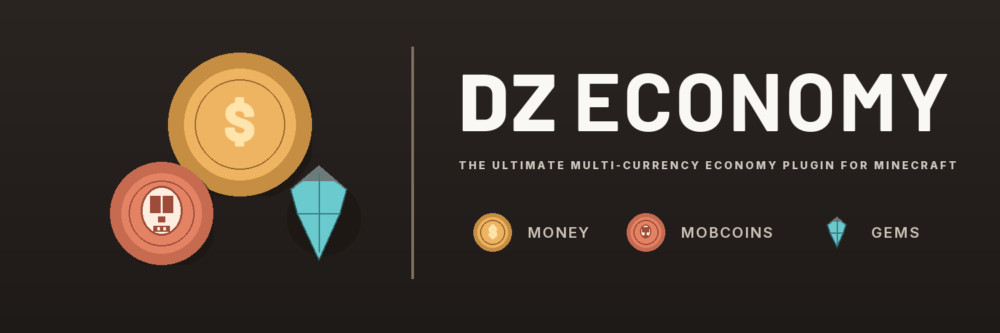
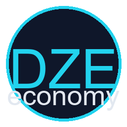

<div align="center">



<br>



# DZEconomy

### Multi-Currency Economy Plugin for Minecraft

[](https://github.com/DemonZ-Development/DZEconomy/releases)
[](https://www.gnu.org/licenses/gpl-3.0.en.html)
[](https://adoptium.net/)
[](https://papermc.io/)

[](https://modrinth.com/plugin/dzeconomy)
[](https://discord.com/invite/GYsTt96ypf)
[](https://github.com/DemonZ-Development/DZEconomy/wiki)

</div>

---

DZEconomy is a practical, high-performance economy plugin built for **Paper 1.16+**, **Spigot**, **Folia**, and **Purpur**. It gives you three independent currencies out of the box: **Money**, **MobCoins**, and **Gems**, with configurable symbols, starting balances, and transaction limits. LuckPerms rank multipliers, combat tagging, PvP loot stealing, mob rewards, currency conversion, and SQLite/MySQL storage are included without extra dependencies.

---

## What this version includes

| Area | Details |
|------|---------|
| Currencies | Money, MobCoins, Gems — each with its own symbol, decimals, and limits |
| Rank system | LuckPerms multipliers, tax rates, and combat-tag bypass per rank |
| Economy safety | Combat tagging, blocked actions, minimum balance protection, world blacklists |
| Storage | SQLite by default, plus MySQL with HikariCP and FlatFile migration |
| Compatibility | Bukkit, Spigot, Paper, Purpur, and Folia |

---

## Commands

### Player commands
- `/money` — check your balance
- `/mobcoin` — check MobCoins
- `/gem` — check Gems
- `/money send <player> <amount>` — send money
- `/money top` — money leaderboard
- `/economy convert <player> <from> <to> <amount>` — convert currencies

### Admin commands
- `/economy reload` — reload config
- `/economy status` — plugin status and stats
- `/economy migrate <from> <to>` — change storage backend
- `/economy baltop [currency] [page]` — global leaderboard
- `/money add/remove/set <player> <amount>` — adjust balances
- `/mobcoin add/remove/set <player> <amount>` — adjust MobCoins
- `/gem add/remove/set <player> <amount>` — adjust Gems

See the [Commands Wiki](https://github.com/DemonZ-Development/DZEconomy/wiki/Commands) for the full reference.

---

## Configuration

A default `config.yml` is created on first startup. Core sections cover currencies, combat tagging, storage backend, ranks, and messages. Start with the defaults, then enable the features your server actually uses.

Example currency setup:

```yaml
currencies:
  money:
    enabled: true
    symbol: "$"
    starting-balance: 500.0
    decimal-places: 2
    supports-decimals: true
    player-pay: true

  mobcoin:
    enabled: true
    symbol: "★"
    starting-balance: 0
    decimal-places: 0
    supports-decimals: false
    player-pay: true

  gem:
    enabled: true
    symbol: "◆"
    starting-balance: 0
    decimal-places: 0
    supports-decimals: false
    player-pay: true

storage:
  backend: sqlite
  save-interval: 60
  cache-size: 1000

combat-tag:
  enabled: true
  duration: 15
  blocked-actions:
    - send
    - request
    - accept
```

See the [Configuration Wiki](https://github.com/DemonZ-Development/DZEconomy/wiki/Configuration) for every option.

---

## Quick setup

1. Download the latest release from [Modrinth](https://modrinth.com/plugin/dzeconomy) or [GitHub Releases](https://github.com/DemonZ-Development/DZEconomy/releases)
2. Place `DZEconomy-2.1.0.jar` in `plugins/`
3. Restart once
4. Edit `plugins/DZEconomy/config.yml`
5. Run `/economy reload`

---

## Developer API

Hook into DZEconomy from your own plugins with a clean API.

### Maven
```xml
<repository>
    <id>jitpack</id>
    <url>https://jitpack.io/</url>
</repository>

<dependency>
    <groupId>com.github.DemonZ-Development</groupId>
    <artifactId>DZEconomy</artifactId>
    <version>2.1.0</version>
    <scope>provided</scope>
</dependency>
```

### Gradle
```groovy
repositories {
    maven { url 'https://jitpack.io' }
}

dependencies {
    compileOnly 'com.github.DemonZ-Development:DZEconomy:2.1.0'
}
```

### Usage
```java
DZEconomy dzeconomy = (DZEconomy) Bukkit.getPluginManager().getPlugin("DZEconomy");
DZEconomyAPI economy = dzeconomy.getAPI();

double balance = economy.getBalance(player.getUniqueId(), CurrencyType.MONEY);
economy.addCurrency(player.getUniqueId(), CurrencyType.MOBCOIN, 50);
```

See the [API Wiki](https://github.com/DemonZ-Development/DZEconomy/wiki/API) for the full reference.

---

## Building from source

- Java 21 JDK
- Git

```bash
git clone https://github.com/DemonZ-Development/DZEconomy.git
cd DZEconomy
./gradlew shadowJar
```

Run tests with `./gradlew test`.

---

## Links

| Resource | URL |
|----------|-----|
| Modrinth | [modrinth.com/plugin/dzeconomy](https://modrinth.com/plugin/dzeconomy) |
| Discord | [discord.com/invite/GYsTt96ypf](https://discord.com/invite/GYsTt96ypf) |
| Wiki | [github.com/DemonZ-Development/DZEconomy/wiki](https://github.com/DemonZ-Development/DZEconomy/wiki) |
| Issues | [github.com/DemonZ-Development/DZEconomy/issues](https://github.com/DemonZ-Development/DZEconomy/issues) |
| Source | [github.com/DemonZ-Development/DZEconomy](https://github.com/DemonZ-Development/DZEconomy) |
| Website | [demonzdevelopment.online](https://demonzdevelopment.online) |

---

DZEconomy v2.1.0 — Made with ❤️ by [DemonZ Development](https://github.com/DemonZ-Development)

[⬆ Back to Top](#dzeconomy)

</div>
