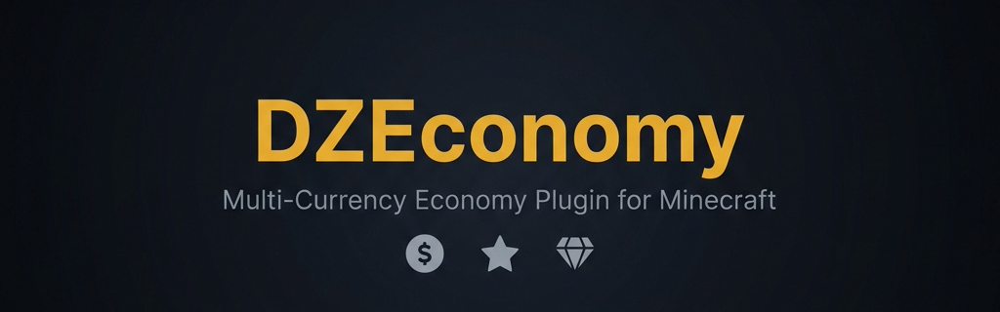

# 💰 DZEconomy — Multi-Currency Economy Plugin

> **A powerful, feature-rich economy plugin with 3 currencies, ranks, combat tagging, mob rewards, and Folia support.**

---

## ✨ Features

💵 **Three Currencies** — Money ($), MobCoins (⛃), and Gems (◆), each fully configurable with custom symbols, decimal places, starting balances, and transaction limits.

🏆 **Rank Multipliers** — LuckPerms integration with per-currency earning bonuses, reduced cooldowns, increased daily limits, combat tag bypass, and interest earnings.

⚔️ **Combat Tagging** — Prevent economy abuse during PvP with configurable combat tag duration, action bar indicator, and blocked actions.

💀 **PvP Loot** — Kill players to steal a configurable percentage of their balance, with minimum balance protection and world blacklists.

🐷 **Mob Rewards** — Configurable rewards for killing mobs across 4 categories (neutral, easy, hard, boss) with kill streak bonuses and time-based event multipliers.

🔄 **Currency Conversion** — Convert between currencies with configurable exchange rates and transaction fees.

📊 **Balance Leaderboards** — Per-currency and global baltop with pagination, offline player support, and cached refresh.

💸 **Payment Requests** — Request, accept, and deny payments with timeout, max pending limits, and sound notifications.

🌐 **PlaceholderAPI Support** — 15+ placeholders with 3-second caching for scoreboards, chat, and tab lists.

🗄️ **Multiple Storage Backends** — SQLite (default), MySQL with HikariCP pooling, and Flat File with live migration between backends.

🚀 **Folia Compatible** — Full region-based scheduling support with automatic Folia detection and transparent scheduler adaptation.

🔔 **Update Checker** — Automatic Modrinth API update notifications for admins.

💾 **Auto-Save & Backups** — Configurable auto-save intervals and manual backup creation.

🎯 **Daily Limits & Cooldowns** — Per-currency transfer limits and cooldowns to prevent economy abuse.

📜 **Transaction Logging** — Optional audit log with file rotation for compliance and debugging.

🔧 **Fully Configurable** — Every message, format, and behavior can be customized in `messages.yml`.

---

## 📸 Screenshots

| | |
|---|---|
|  |  |
| *Balance Display* | *Baltop Leaderboard* |
|  |  |
| *Combat Tag Indicator* | *Mob Reward Notification* |
|  |  |
| *Payment Request* | *Admin Status Panel* |

---

## ⚡ Quick Start

1. Download and place `DZEconomy-2.0.0.jar` in your `plugins/` folder
2. Restart your server
3. Players can immediately use `/money`, `/mobcoin`, `/gem`
4. Customize `config.yml`, `ranks.yml`, and `mob-rewards.yml`
5. Run `/economy reload` to apply changes

> New players start with **$500.00** by default (configurable)

---

## 📋 Commands Quick Reference

### Currency Commands (`/money`, `/mobcoin`, `/gem`)

| Command | Description |
|---------|-------------|
| `/<currency>` | Check your balance |
| `/<currency> balance [player]` | Check balance (self or others) |
| `/<currency> send <player> <amount>` | Send currency to a player |
| `/<currency> request <player> <amount>` | Request currency from a player |
| `/<currency> accept <player>` | Accept a payment request |
| `/<currency> deny <player>` | Deny a payment request |
| `/<currency> top [page]` | View balance leaderboard |
| `/<currency> add <player> <amount>` | ⚙️ Add currency (admin) |
| `/<currency> remove <player> <amount>` | ⚙️ Remove currency (admin) |
| `/<currency> set <player> <amount>` | ⚙️ Set balance (admin) |

### Admin Commands (`/economy`)

| Command | Description |
|---------|-------------|
| `/economy info` | View plugin information |
| `/economy credits` | View credits |
| `/economy reload` | ⚙️ Reload configuration |
| `/economy version` | ⚙️ Version information |
| `/economy status` | ⚙️ Plugin status & stats |
| `/economy convert <player> <from> <to> <amount>` | ⚙️ Convert currency |
| `/economy migrate <from> <to>` | ⚙️ Migrate storage backend |
| `/economy baltop [currency] [page]` | ⚙️ Global leaderboard |
| `/economy payall <currency> <amount>` | ⚙️ Pay all online players |
| `/economy backup` | ⚙️ Create data backup |

---

## 🔧 Configuration Highlights

### Three Fully Configurable Currencies

```yaml
currencies:
  money:
    enabled: true
    singular: "Dollar"
    plural: "Dollars"
    symbol: "$"
    decimal-places: 2
    starting-balance: 500.00
    max-balance: -1
    min-transaction: 0.01
    display-format: "{symbol}{amount}"
```

### Rank Multipliers with LuckPerms

```yaml
premium:
  display-name: "&6Premium"
  priority: 2
  multipliers:
    money: 1.5
    mobcoin: 2.0
    gem: 1.5
  perks:
    reduced-cooldown: true
    cooldown-reduction: 0.5
    bypass-combat-tag: true
    interest:
      enabled: true
      rate: 0.1
      interval: 86400
```

### Combat Tagging

```yaml
combat-tag:
  enabled: true
  duration: 15
  blocked-actions: [send, request, accept]
  action-bar:
    enabled: true
    format: "&c&l⚔ &eCombat Tag &7- &c{time}s remaining"
```

---

## 🖥️ Server Compatibility

| Software | Versions | Java |
|----------|----------|------|
| Bukkit | 1.16 – 1.21.5 | 17+ (21 recommended) |
| Spigot | 1.16 – 1.21.5 | 17+ (21 recommended) |
| Paper | 1.16.5 – 1.21.5 | 17+ (21 recommended) |
| Folia | 1.19.4 – 1.21.5 | 17+ (21 recommended) |
| Purpur | 1.16.5 – 1.21.5 | 17+ (21 recommended) |

---

## 📦 Optional Dependencies

| Plugin | Purpose | Required? |
|--------|---------|-----------|
| [PlaceholderAPI](https://modrinth.com/plugin/placeholderapi) | Placeholders for scoreboards, chat, etc. | No |
| [LuckPerms](https://modrinth.com/plugin/luckperms) | Rank detection for multiplier system | No |

---

## 📊 bStats


---

## 🔗 Links

| Resource | URL |
|----------|-----|
| Wiki | [GitHub Wiki](https://github.com/DemonZDevelopment/DZEconomy/wiki) |
| Discord | [discord.com/invite/GYsTt96ypf](https://discord.com/invite/GYsTt96ypf) |
| Source Code | [GitHub](https://github.com/DemonZDevelopment/DZEconomy) |
| Issue Tracker | [GitHub Issues](https://github.com/DemonZDevelopment/DZEconomy/issues) |
| Website | [demonzdevelopment.online](https://demonzdevelopment.online) |

---

## 📜 License

GNU General Public License v3.0

---

*Made with ❤️ by DemonZ Development*
